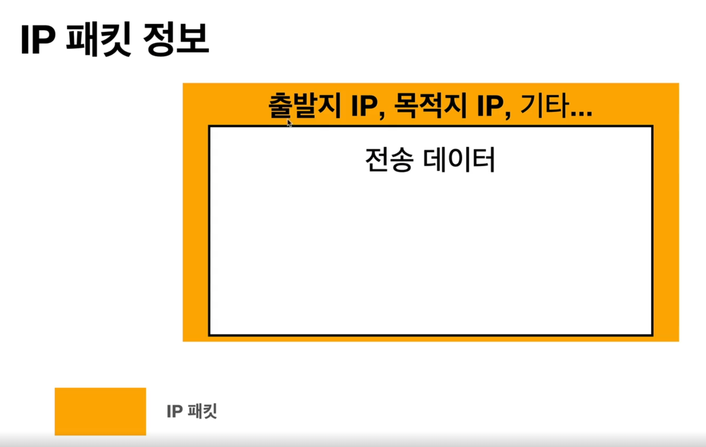
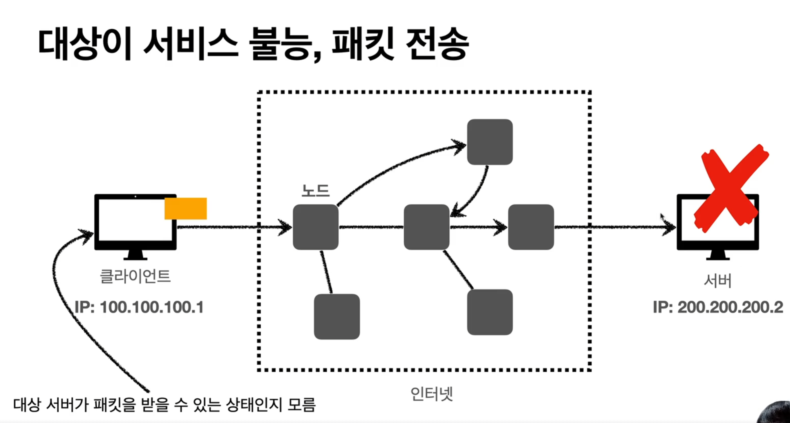
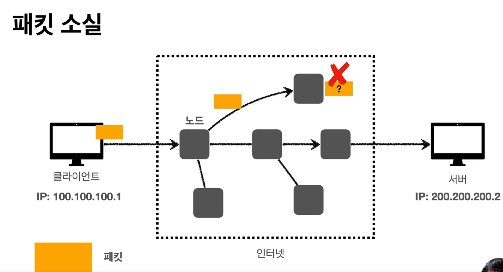
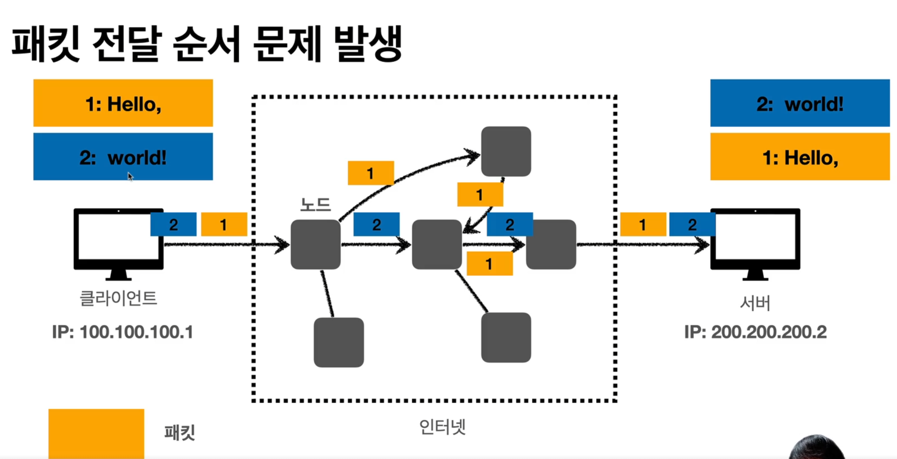

# http-study

+ ## 인터넷 네트워크
  + ### 인터넷 통신
  + ### IP(Internet Protocol)
    + 지정한 IP 주소(IP Address)에 데이터 전달
    + 패킷(Packet)이라는 통신 단위로 데이터 전달
    + 패킷
      + 
    + IP 프로토콜의 한계
      + 비연결성
        + 패킷을 받을 대상이 없거나 서비스 불능 상태여도 패킷 전송
          + 
      + 비신뢰성
        + 중간에 패킷이 사라지면?
          + 
        + 패킷이 순서대로 오지 않으면?
          + 
      + 프로그램 구분
        + 같은 IP를 사용하는 서버에서 통신하는 애플리케이션이 둘 이상이면?
  + ### TCP
    +    
  + ### UDP
  + ### PORT
  + ### DNS               