# http-study

+ ## 인터넷 네트워크
  + ### 인터넷 통신
  + ### IP(Internet Protocol)
    + 지정한 IP 주소(IP Address)에 데이터 전달
    + 패킷(Packet)이라는 통신 단위로 데이터 전달
    + 패킷
      + 
    + IP 프로토콜의 한계
      + 비연결성
        + 패킷을 받을 대상이 없거나 서비스 불능 상태여도 패킷 전송
          + 
      + 비신뢰성
        + 중간에 패킷이 사라지면?
          + 
        + 패킷이 순서대로 오지 않으면?
          + 
      + 프로그램 구분
        + 같은 IP를 사용하는 서버에서 통신하는 애플리케이션이 둘 이상이면?
  + ### 인터넷 프로토콜 스택의 4계층
    + 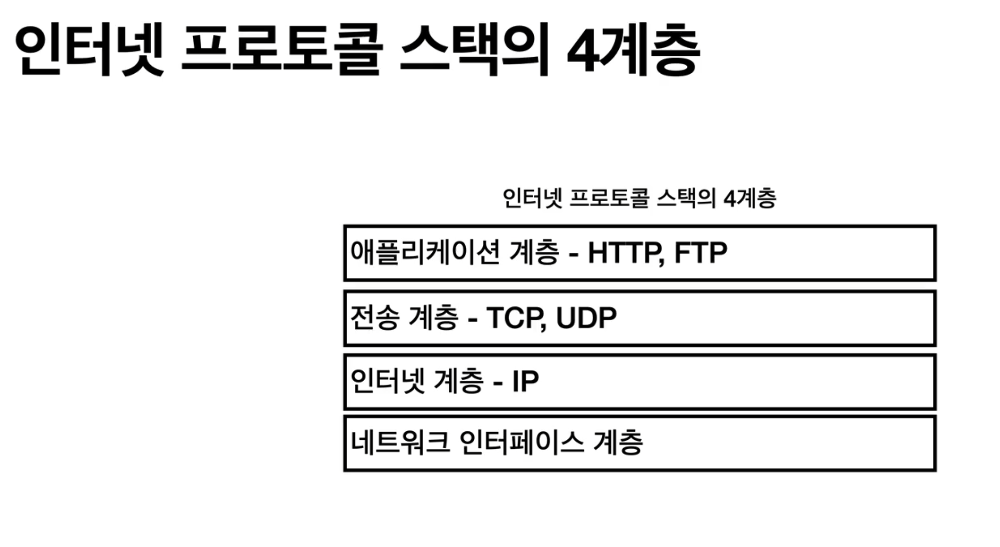
    + 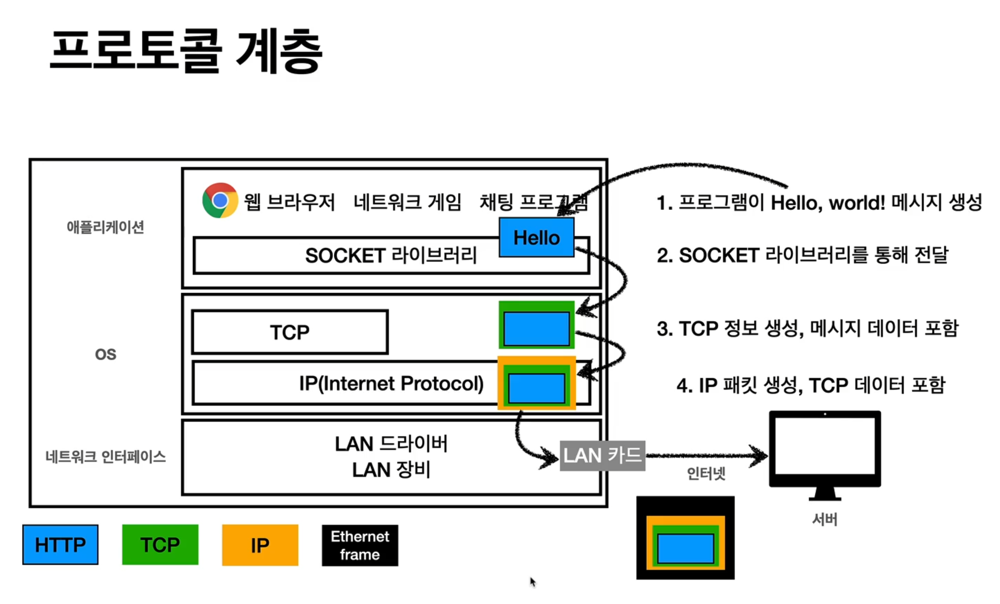
      + ### 1. 애플리케이션 계층 - HTTP, FTP
        +    
      + ### 2. 전송 계층 - TCP, UDP
        + TCP : 전송 제어 프로토콜 (Transmission Control Protocol)
          + 특징
            + 연결 지향 - TCP 3 way handshake (가상 연결)
              + 3 way handshake
                + 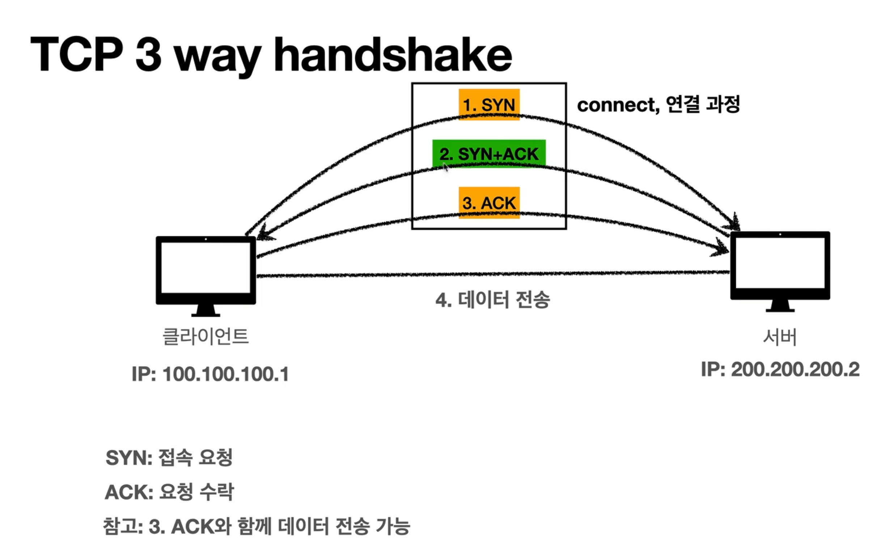
                + TCP/IP 프로토콜을 이용해서 통신을 하는 응용프로그램이 데이터를 전송하기 전에 먼저 정확한 전송을 보장하기 위해 상대방 컴퓨터와 사전에 에션을 수립하는 과정
            + 데이터 전달 보증
              + 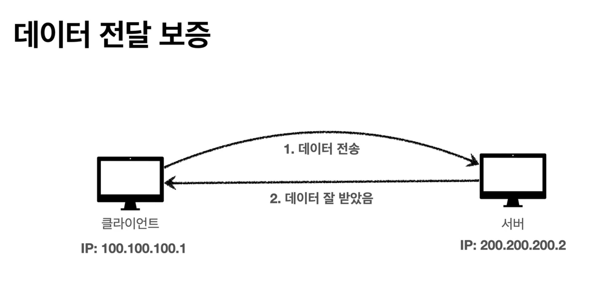
            + 순서 보장
              + 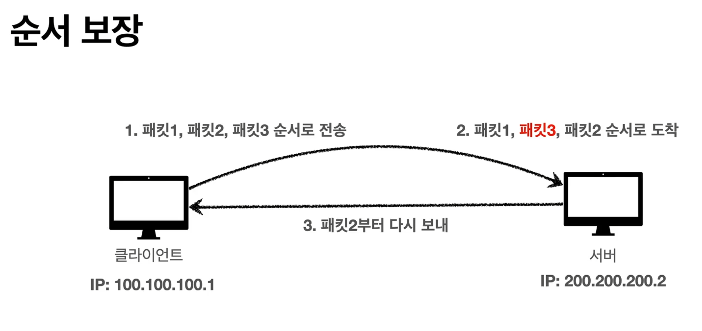
            + 신뢰할 수 있는 프로토콜
            + 현재는 대부분 TCP 사용
          + TCP 세그먼트
            + 출발지 PORT
            + 목적지 PORT
            + 전송 제어
            + 순서
            + 검증 정보
        + UDP : 사용자 데이터그램 프로토콜 (User Datagram Protocol)
          + 특징
            + 하얀 도화지에 비유(기능이 거의 없음)
            + 연결 지향 - TCP 3 way handshake X
            + 데이터 전달보증 X
            + 순서 보장 X
            + 데이터 전달 및 순서가 보장되지 않지만, 단순하고 빠름
            + 정리
              + IP와 거의 같다. PORT 체크성 정도만 추가
              + 애플리케이션에서 추가 작업 필요
      + ### 3. 인터넷 계층 - IP
        + IP 패킷 정보 
          + 출발지 IP
          + 목적지 IP
      + ### 4. 네트워크 인터페이스 계층
  + ### PORT
    + 정의 : 
      + 같은 IP 내에서 프로세스 구분
    + 0 ~ 65535 할당 가능
    + 0 ~ 1023 : 잘 알려진 포트, 사용하지 않는것이 좋음
      + FTP : 20, 21
      + TELNET : 23
      + HTTP : 80
      + HTTPS : 443
  + ### DNS 
    + 정의 : 
      + 도메인 네임 시스템 (Domain Name System)
    + 전화번호부
    + 도메인 명을 IP 주소로 변환
    + DNS 사용 :
      + 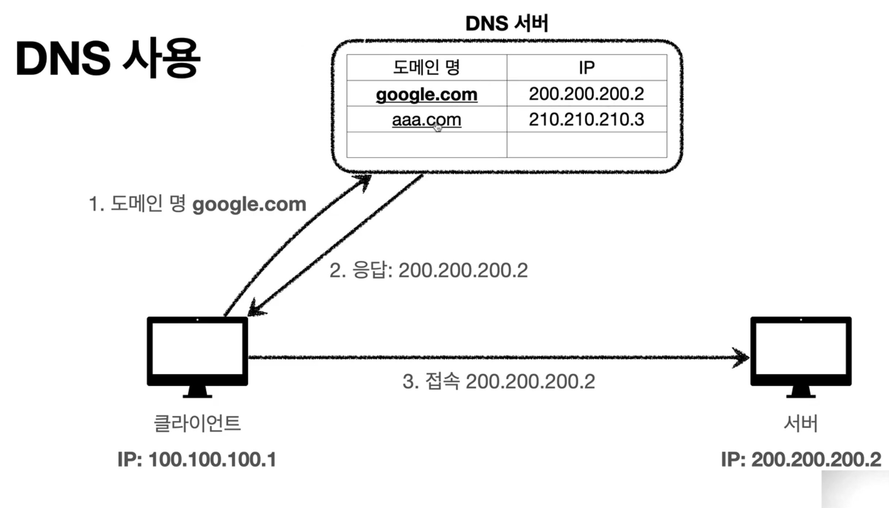
+ ## URI (Uniform Resource Identifier)
  + 정의 :
    + Uniform : 리소스 식별하는 통일된 방식
    + Resource : 자원, URI로 식별할 수 있는 모든 것(제한 없음)
    + Identifier : 다른 항목과 구분하는데 필요한 정보
    + 문법 : 
      + scheme : //[userinfo@]host[:port][/path][?query][#fragment]
      + 예) https://www.google.com:443/search?q=hello&hl=ko 
      + 프로토콜 : https
        + 어떤 방식으로 자원에 접근할 것인가 하는 약속 규칙
      + 호스트 명 : www.google.com
      + 포트 번호 : 443
      + path : /search
        + 리소스 경로, 계층적 구조
      + query : q=hello&hl=ko
        + key=value 형태
        + ?로 시작, &로 추가 가능
        + query parameter, query string 등으로 불림, 웹 서버에 제공하는 파라미터 문자 형태
    + ### URL (Uniform Resource Locator) : 리소스가 있는 위치를 지정
    + ### URN (Uniform Resource Name) : 리소스에 이름을 부여
      + URL, URN 정의 : 
        + 위치는 변할 수 있지만, 이름은 변하지 않는다.
        + urn:isbn:8960777331 (어떤 책의 isbn URN)
        + URN 이름만으로 실제 리소스를 찾을 수 있는 방법이 보편화 되지 않음
        + 앞으로 URI를 URL과 같은 의미로 이야기
+ ## HTTP 메서드
  + ### API URI 고민
    + 리소스의 의미
      + 회원을 등록하고 수정하고 조회하는게 리소스가 아니다!
      + 예) 미네랄을 캐라 -> <U>**미네랄**</U>이 리소스
      + <U>**회원이라는 개념 자체가 바로 리소스다.**</U>
    + 리소스를 어덯게 식별하는게 좋을까?
      + 회원을 등록하고 수정하고 조회하는 것을 모두 배제
      + <U>**회원이라는 리소스만 식별하면 된다. -> 회원 리소스를 URI에 매핑**</U>
  + ### 리소스와 행위를 분리 
    + URI는 리소스만 식별!
    + 리소스와 해당 리소소를 대상으로 하는 행위를 분리
      + 리소스 : 회원
      + 행위 : 조회, 등록, 삭제, 변경
    + 리소스는 명사, 행위는 동사
  + ### 메서드
    + ### 속성 : 
      + 안전(Safe Methods)
        + 호출해도 리소스를 변경하지 않는다.
        + 안전은 해당 리소스만 고려한다.
      + 멱등(Idempotent Methods)
        + f(f(x)) = f(x)
        + 한번 호출하든 두번 호출하든 100번 호출하든 결과가 똑같다.
        + 멱등 메서드
          + GET : 한번 조회하든, 두번 조회하는 같은 결과가 조회된다.
          + PUT : 결과를 대체한다. 따라서 같은 요청을 여러번 해도 최종 결과는 같다.
          + DELETE : 결과를 삭제한다. 같은 요청을 여러번 해도 삭제된 결과는 똑같다.
        + 예외 메서드
          + POST : <U>**멱등이 아니다!**</U> 두번 호출하면 같은 결제가 중복해서 발생할 수 있다.
        + 활용 : 
          + 자동 복구 매커니즘
          + 서버가 TIMEOUT 등으로 정상 응답을 못주었을 때, 클라이언트가 같은 요청을 다시 해도되는가? 판단 근거
        + 예)
          + Q. 재요청 중간에 다른곳에서 리소스를 변경해버리면?
            + 사용자1 : GET -> username:A, age:20
            + 사용자2 : PUT -> username:A, age:30
            + 사용다1 : GET -> username:A, age:30 -> <U>**사용자2의 영향으로 바뀐 데이터 조회**</U>
          + A. <U>**멱등은 외부 요인으로 중간에 리소스가 변경되는 것 까지 고려하지는 않는다.**</U>
      + 캐시가능(Cacheable Methods)
        + 응답 결과 리소스를 캐시해서 사용해도 되는가?
        + GET, HEAD, POST, PATCH 캐시 가능
        + 실제로는 GET, HEAD 정도로만 캐시로 사용
          + POST, PATCH는 본문 내용까지 캐시 키로 고려해야 하는데, 구현이 쉽지 않음
    + ### GET : 리소스 조회
      + 의미 : 
        + 리소스 조회
        + 서버에 전달하고 싶은 데이터는 query(쿼리 파라미터, 쿼리 스트릴)를 통해서 전달
        + 메시지 바디를 사용해서 데이터를 전달할 수 있지만, 지원하지 않는 곳이 많아서 권장하지 않음
      + 순서 : 
        + 1. 리소스 조회 - 메시지 전달 
          + 
        + 2. 리소스 조회 - 서버 도착 
          + 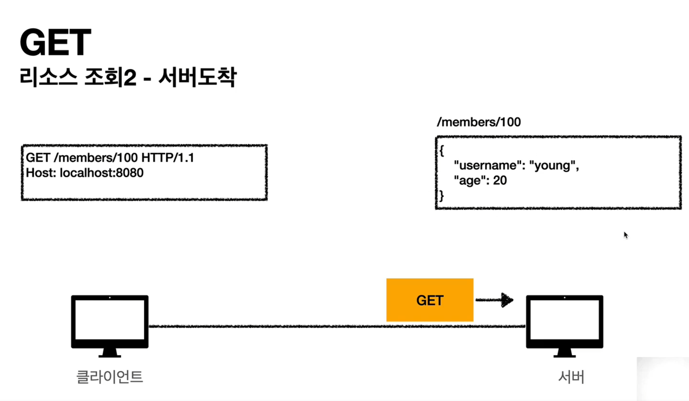
        + 3. 리소스 조회 - 응답 데이터
          + 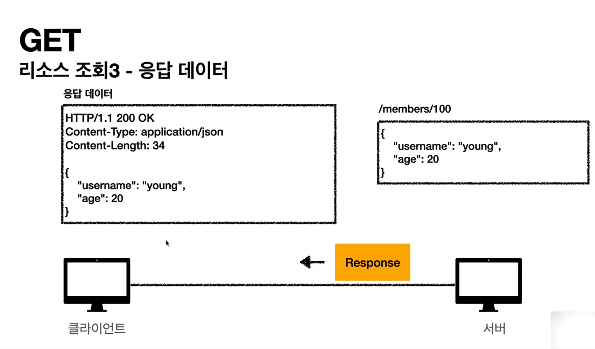
    + ### POST : 요청 데이터 처리, 주로 등록에 사용
      + 의미 : 
        + 요청 데이터 처리
        + <U>**메시지 바디를 통해 서버로 요청 데이터 전달**</U>
        + 서버는 요청 데이터를 처리
          + 메시지 바디를 통해 들어온 데이터를 처리하는 모든 기능을 수행한다.
        + 주로 전달된 데이터로 신규 리소스 등록, 프로세스 처리에 사용
      + 순서 : 
        + 1. 리소스 등록 - 메시지 전달
          + 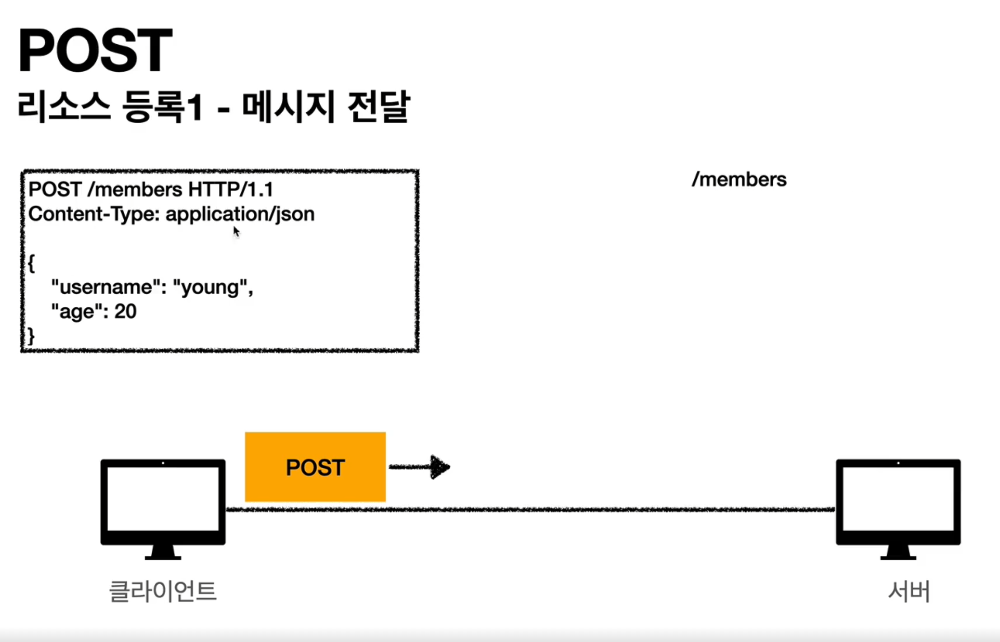
        + 2. 리소스 등록 - 신규 리소스 생성
          + 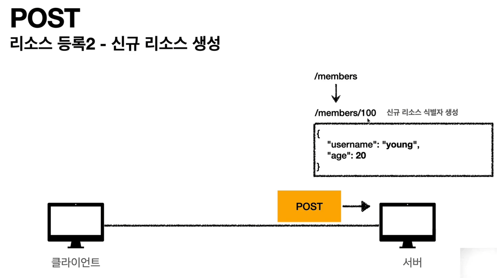
        + 3. 리소스 등록 - 응답 데이터
          + 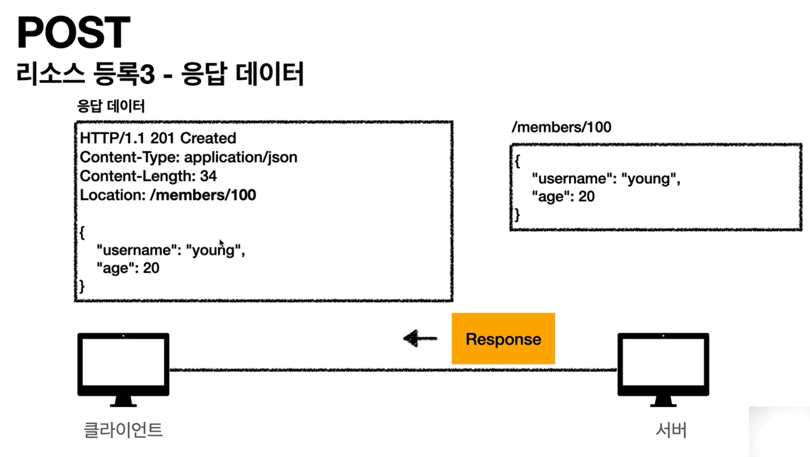
      + 스펙 : POST 메서드는 대상 리소스가 리소소의 고유 한 의미 체계에 따라 요청에 포함 된 표현을 처리하도록 요청 합니다.
      + 예)
        + HTML 양식에 입력 된 필드와 같은 데이터 블록을 데이터 처리 프로세스에 제공
          + 예) HTML FORM에 입력한 정보로 회원가입, 주문 등에서 사용
        + 게시판 뉴스 그룹, 메일링 리스트, 블로그 또는 유사한 기사 그룹에 메시지 게시
          + 예) 게시판 글쓰기, 댓글 달기
        + 서버가 아직 식별하지 않은 새 리소스 생성
          + 예) 신규 주문 생성
        + 기존 자원에 데이터 추가
          + 예) 한 문서 끝에 내용 추가하기
      + 정리 : <U>**이 리소스 URI에 POST 요청이 오면 요청 데이터를 어떻게 처리할지 리소스마다 따로 정해야함 -> 정해진 것이 없다.**</U>
        + 1. 새 리소스 생성(등록)
          2. 요청 데이터 처리
          3. 다른 메서드를 처리하기 애매한 경우
    + #### PUT : 리소스를 (완전히) 대체, 해당 리소스가 없으면 생성 
      + 리소스를 대체 : 
        + 리소스가 있으면 대체
          + 1. 리소스가 있는 경우
            + 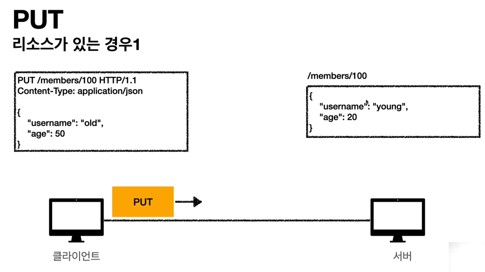
            + 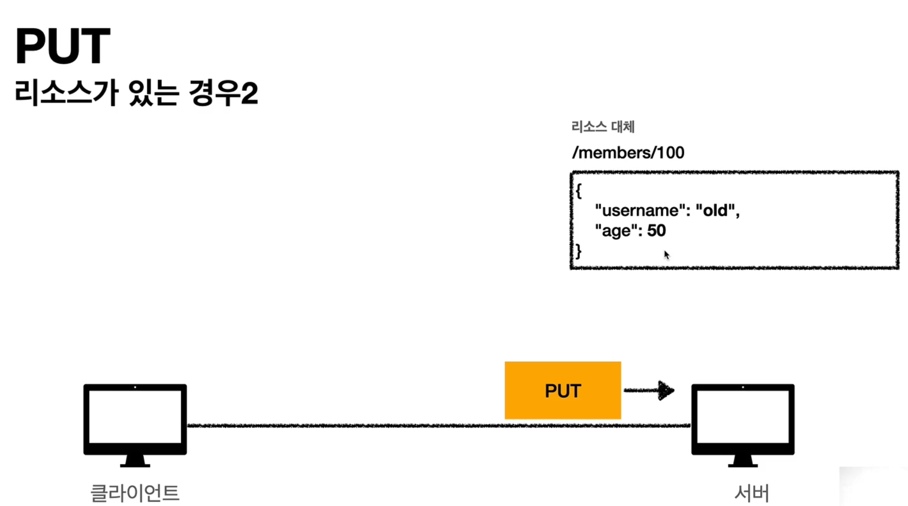
        + 리소스가 없으면 생성
          + 2. 리소스가 없는 경우
            + 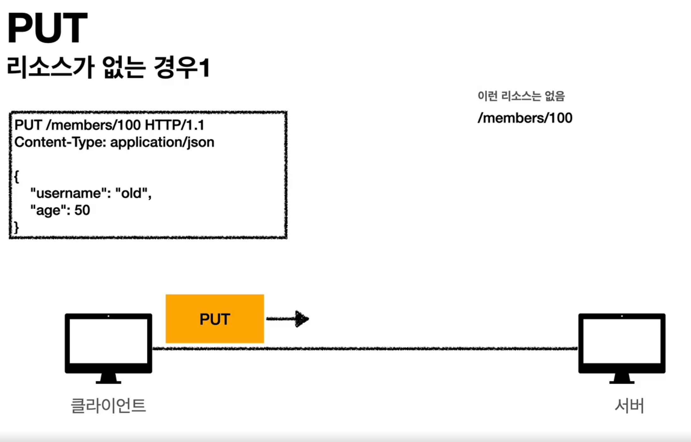
            + 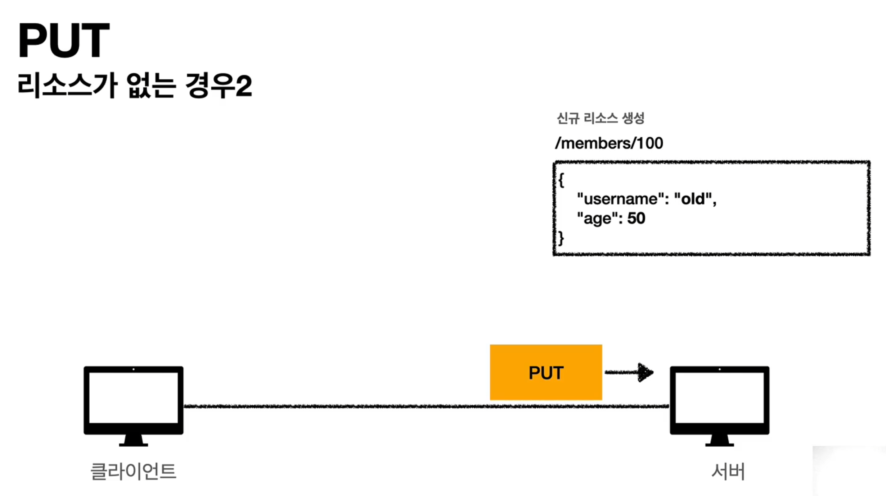 
        + 리소스 대체 
          + 3. 리소스를 완전히 대체
            + 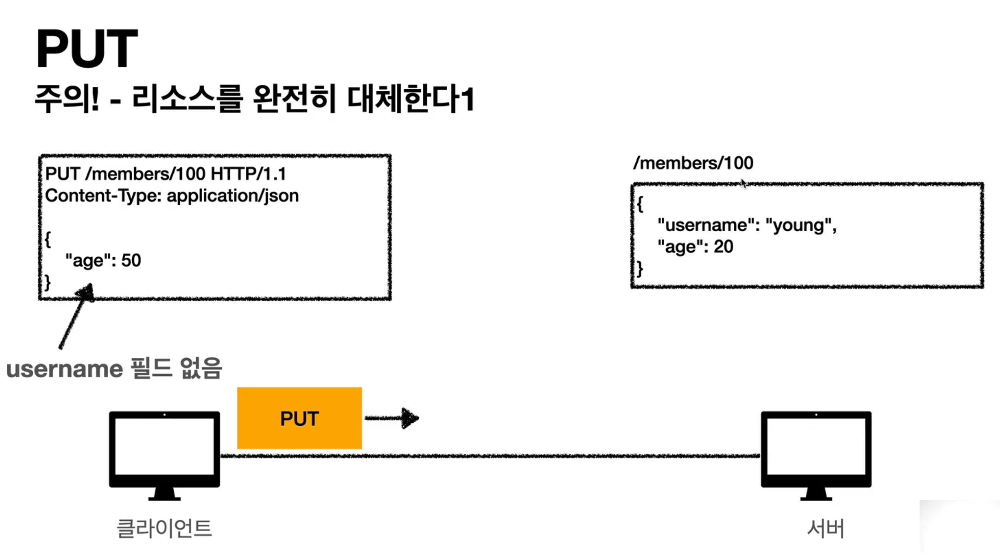
            + 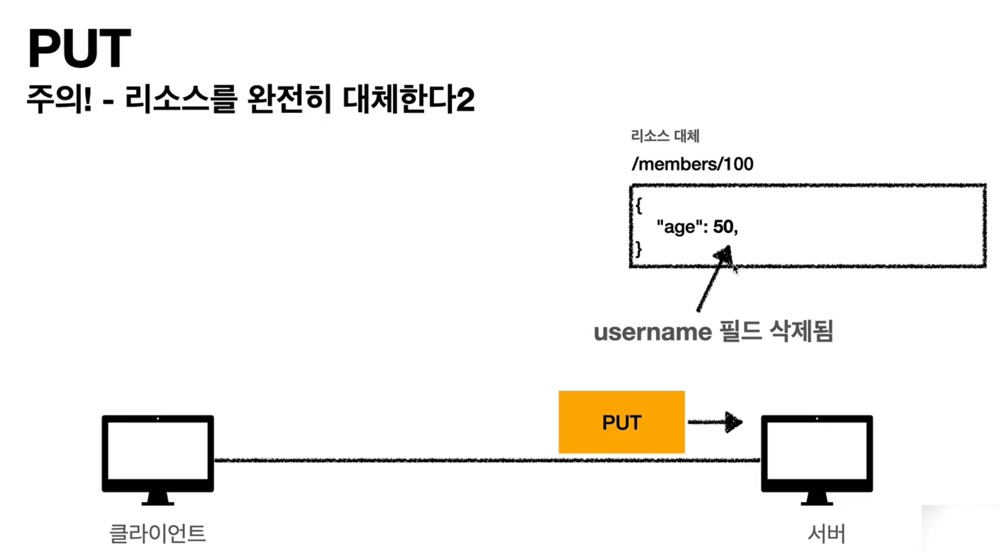  
      + 중요! 클라이언트가 리소스를 식별
        + 클라이언트가 리소스 위치를 알고 URI 지정
        + POST와 차이점
    + ### PATCH : 리소스 부분 변경
      + 순서 : 
        + 리소스 부분 변경
          + 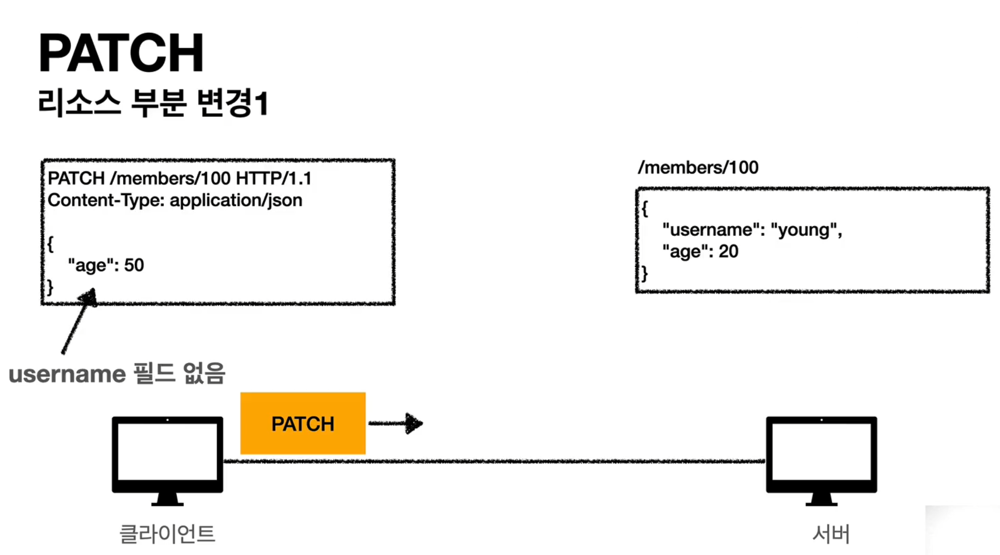
          + 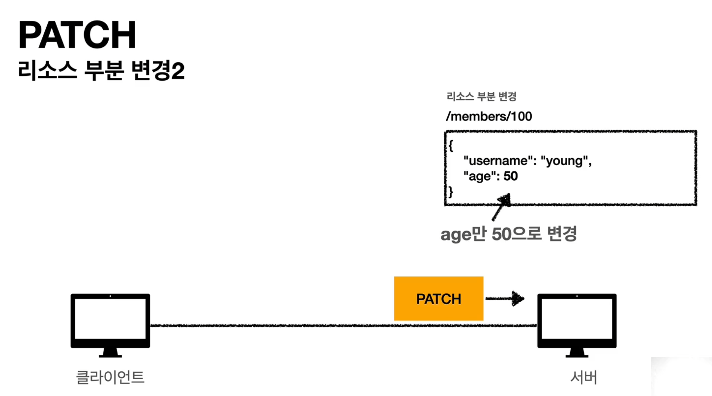
    + ### DELETE : 리소스 삭제
      + 순서 : 
        + 리소스 삭제
          + 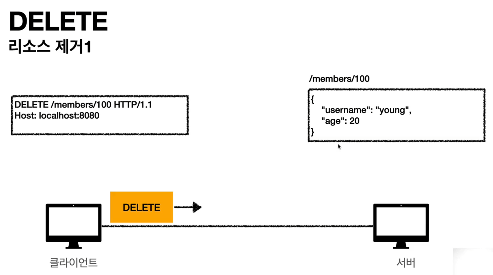
          + 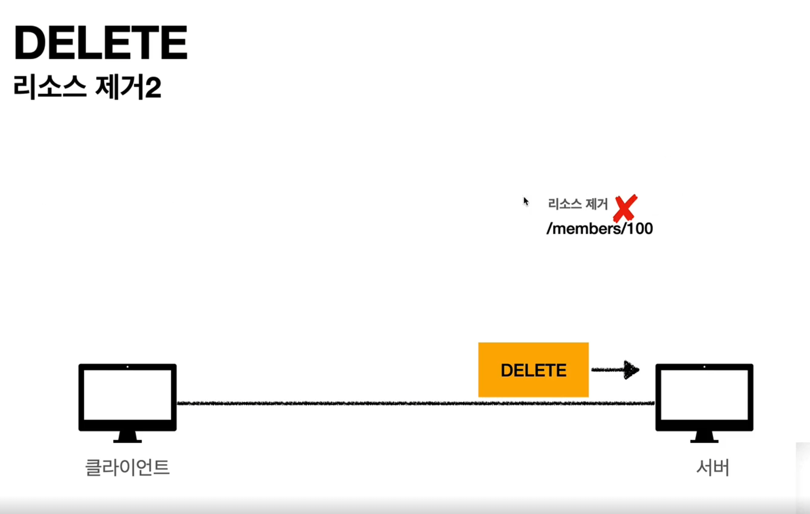
    + ### HEAD : GET과 동일하지만 메시지 부분을 제외하고, 상태 줄과 헤더만 반환
    + ### OPTIONS : 대상 리소스에 대한 통신 가능 옵션(메서드)을 설명(주로 CORS에서 사용)
    + ### CONNECT : 대상 자원으로 식별되는 서버에 대한 터널을 설정
    + ### TRACE : 대상 리소스에 대한 경로를 따라 메시지 루프백 테스트를 수행
    
+ ## 모든것이 HTTP
  + ### HTTP 메시지에 모든 것을 전송
    + HTML, TEXT
    + IMAGE, 음성, 영상, 파일
    + JSON, XML (API)
    + 거으 ㅣ모든 형태의 데이터 전송 가능
    + 서버간에 데이터를 주고 받을 때도 대부분 HTTP 사용
  + ### 기반 프로토콜
  
    + TCP : HTTP/1.1, HTTP/2
    + UPD : HTTP/3
    + 현재 HTTP/1.1 주로 사용
      + HTTP/2, HTTP/3 도 점점 증가
  + ### HTTP 특징
  
    + 클라이언트 서버 구조
    + 무상태 프로토콜(stateless), 비연결성
    + HTTP 메시지
    + 단순함, 확장 가능
  + ### 무상태 트로토콜
  
    + 서버가 클라이언트의 상태를 보존하지 않음
    + 장점 : 서버 확장성 높음(스케일 out)
    + 단점 : 클라이언트가 추가 데이터 전송
    + ### Stateful, Stateless 차이
      + 상태 유지 : 중간에 다른 상태로 바뀌면 안된다.
      + 무상태 : 중간에 다른 상태로 바뀌어도 된다.
        + 값자기 요청이 증가해도 서버를 대거 투입시킬 수 있다.
      + 무상태는 응답 서버를 쉽게 바꿀 수 있다. -> 무한한 서버 증설 가능
      + 실무 한계 :
        + 모든 것을 무상태로 쉽게 할 수 이있는 경우도 있고 없는 경우도 있다.
        + 상태 유지 :
          + 예) 로그인
        + 무상태 :
          + 예) 로그인이 필요없는 단순한 서비스 소개 화면
        + 일반적으로 브라우저 쿠키의 서버 세션등을 사용해서 상태 유지
        + 상태 유지는 최소한만 사용
        
  + ### 비연결성
    + ### 정의
      + HTTP는 기본이 연결을 유지하지 않는 모델
      + 일반적으로 초 단위의 이하 빠른 속도로 응답
      + 1시간 동안 수천명이 서비스를 사용해도 실제 서버에서 동시에 처리하는 요청은 수십개 이하로 매우 작은
        + 예) 브라우저에서 계속 연속해서 검색 버튼을 누르지는 ㅏㅇㄴㅎ는다.
      + 서버 자원을 매우 효율적으로 사용할 수 있음.
    + ### 한계와 극복
      + TCP/IP 연결을 새로 맻어야함 - 3way handshake 시간 추가
      + 웹 브라우저로 사이트를 요청하면 HTML 뿐만 아니라 자바스크립트, css, 추가 이미지 등  수많은 자원이 함께 다운로드
      + HTTP/2, HTTP/3에서 더 많은 최적화
    + ### Stateless를 기억하자
      + 정말 같은 시간에 딱 맞추어 발생하는 대용량 트래픽
      + 예) 선착순 이벤트, 명절 KTX 예약 등
      
  + ### 클라이언트에서 서버로 데이터 전송
    + 쿼리 파라미터를 통한 데이터 전송
      + GET
      + 주로 정렬 필터(검색어)
      + 예) 
        + 정적 데이터 조회
          + 이미지, 정적 텍스트 문서
          + 조회는 GET 사용
          + 정적 데이터는 일반적으로 쿼리 파라미터 없이 리소스 경로로 단순하게 조회 가능
          + 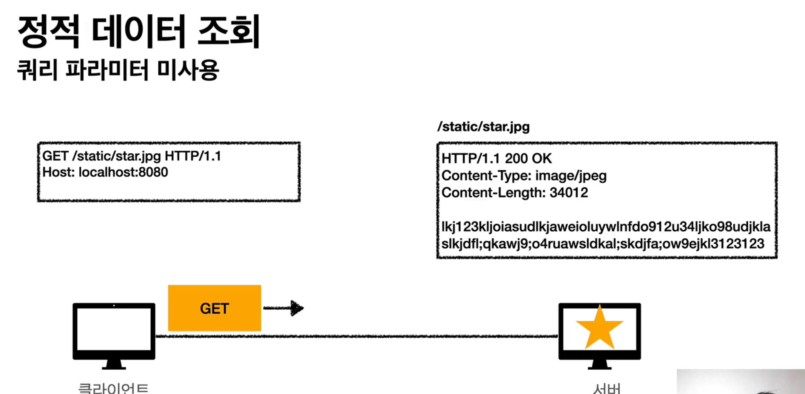
        + 동적 데이터 조회
          + 주로 검색, 게시판 목록에서 정렬 필터(검색어)
          + 조회 조건을 줄여주는 필터, 조회 결과를 정렬하는 정렬 조건에 주로 사용
          + 조회는 GET 사용
          + GET은 쿼리 파라미터 사용해서 데이터 전달
          + 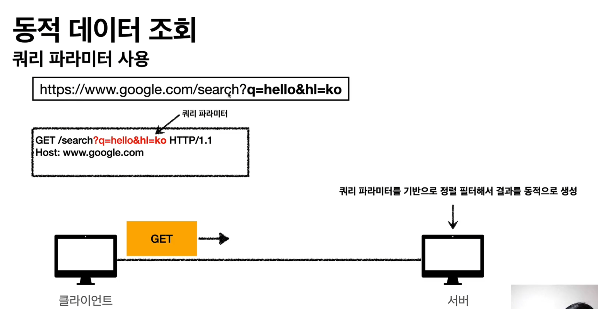
        + <U>**HTML Form**</U>을 통한 데이터 전송
          + 부가설명 : HTML Form 전송은 GET,POST만 지원
            + Content-Type : application/x-www-form-urlencoded 사용
              + form의 내용을 메시지 바디를 통해서 전송(key=value, 쿼리 파라미터 형식)
              + 전송 데이터를 url encoding 처리
              + 회원 가입, 상품 주문, 데이터 변경
              + 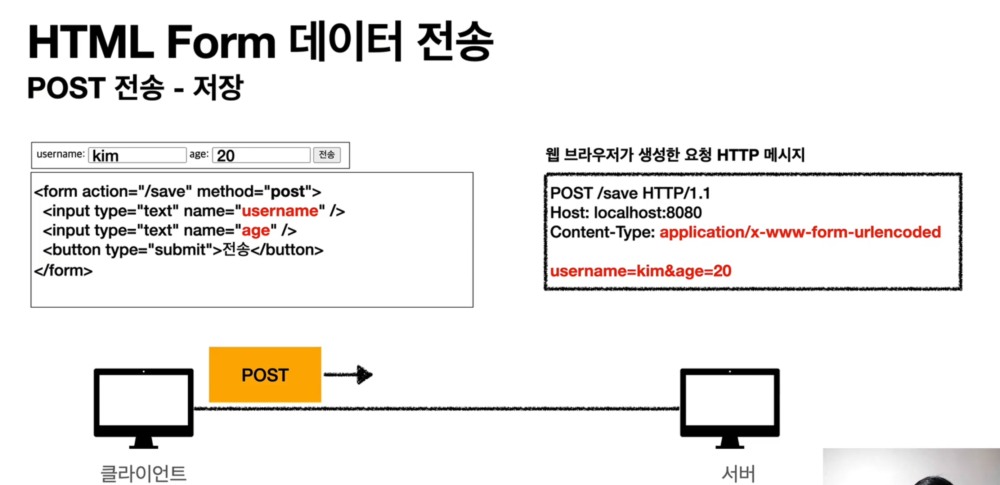
            + Content-Type : multipart/form-data 사용
              + 파일 업로드 같은 바이너리 데이터 전송시 사용
              + form-data 및 파일 데이터를 같이 전송할 때 사용
              + 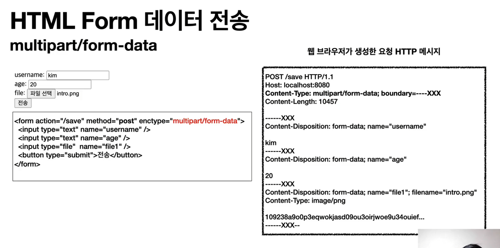
        + <U>**HTTP API**</U>를 통한 데이터 전송
          + 회원 가입, 상품 주문, 데이터 변경
          + 서버 to 서버
            + 백엔드 시스템 통신
          + 앱 클라이언트
            + 아이폰, 안드로이드
          + 웹 클라이언트
            + HTML에서 Form  전송 대신 자바 스크립트를 통한 통신에 사용(Ajax)
            + 예) React, Vue.js 같은 웹 클라이언트와 API 통신
          + POST, PUT, PATCH : 메시지 바디를 통해 데이터 전송
          + GET : 조회, 쿼리 파라미터로 데이터 전달
          + Content-Type : application/json을 주로 사용
            + TEXT, XML, JSON 등
          + 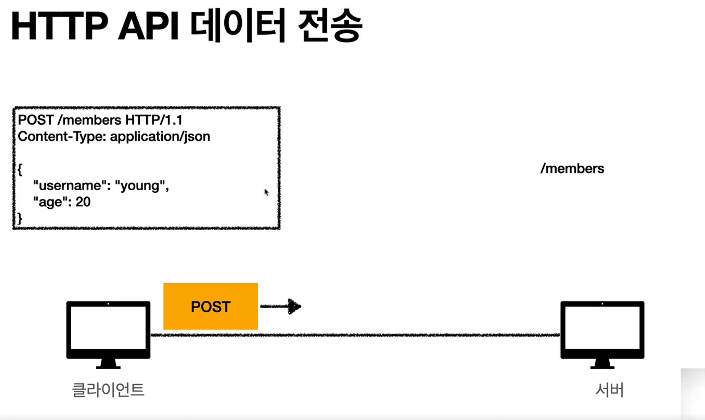
    + 메시지 바디를 통한 데이터 전송
      + POST, PUT, PATCH
      + 회원 가입, 상품 주문, 리소스 등록, 리소스 변경

  + ### HTTP 상태코드
    + ### 2xx (Sucesssful)
      + 200 OK
        + 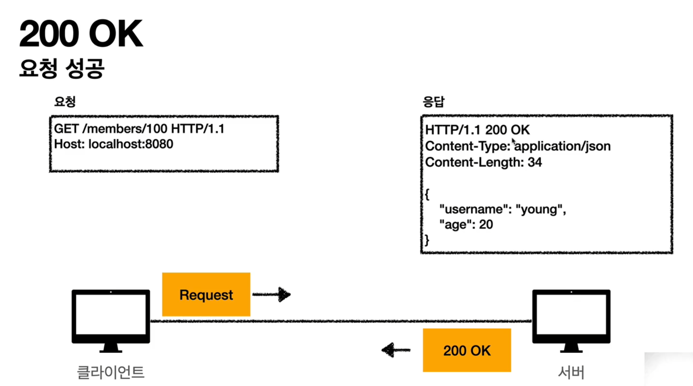
      + 201 Created
        + 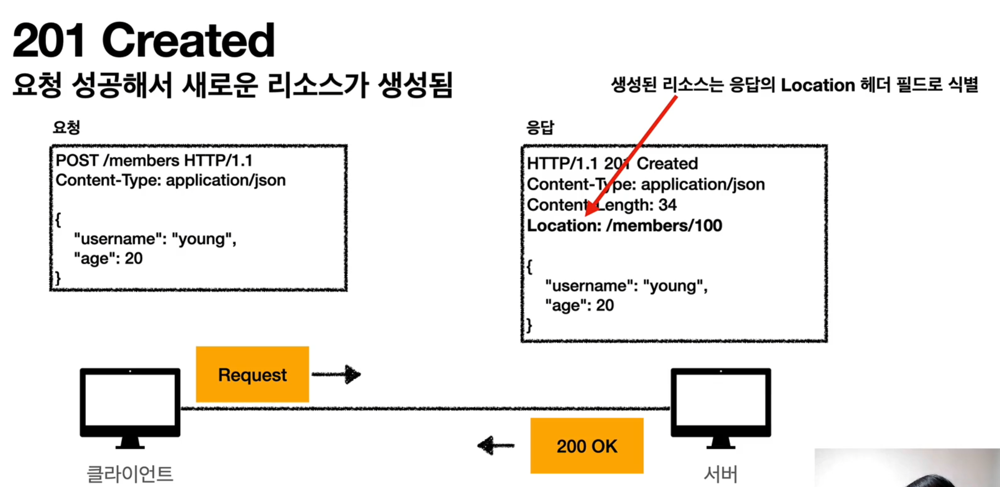
      + 202 Accepted
        + 요청이 접수되었으나 처리가 완료되지 않았음
        + 배치 처리 같은 곳에서 사용
      + 204 No Content
        + 서버가 요청을 성공적으로 수행했지만, 응답 Payload 본문에 보낼 데이터가 없음
        + 예) 웹 문서 편집기에서 save 버튼
        + save 버튼의 결과로 아무 내용이 없어도 된다.
        + save 버튼을 눌러도 같은 화면을 유지해야 한다.
        + 결과 내용이 없어도 204 메시지(2xx)만으로 성공을 인식할 수 있다.
        
    + ### 3xx (Redirection)
      + #### Redirection 이해 : 
        + 웹 브라우저는 3xx 응답의 결과에 <U>**Location**</U> 헤더가 있으면, Location 위치로 자동 이동 (Redirect)
        + 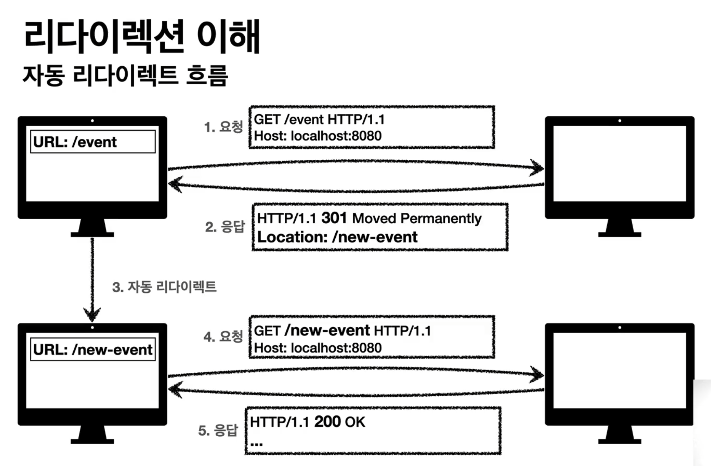
      + 정의 : 
        + #### 영구 Redirection - 특정 리소스의 URI가 영구적으로 이동
          + 리소스의 URI가 영구적으로 이동
          + 원래의 URL을 사용하지 않음, 검색 엔진 등에서도 변경 인지
            + 예) /members -> /users
            + 예) /event -> /new-event 
        + #### 일시 Redirection - 일시적인 변경
          + 리소스의 URI가 일시적으로 변경
          + 따라서 검색 엔진 등에서 URL을 변경하면 안됨
          + 주문 완료 후 주문 내역 화면으로 이동
          + PRG : Post/Redirect/Get
            + 예)
              + POST로 주문 후에 웹 브라우저를 새로고침 하면?
              + 새로고침은 다시 요청
              + <U>**중복 주문이 될 수 있다.**</U>
            + 해결 방법
              + POST로 주문 후에 새로고침으로 인한 중복 주문 방지
              + POST로 주문 후에 주문 결과 화면을 GET 메서드로 Redirect
              + 새로고침 해도 결과 화면은 GET으로 조회됨
              + 중복 주문 대신에 결과 화면만 GET으로 다시 요청
            + 사용 전 
              + 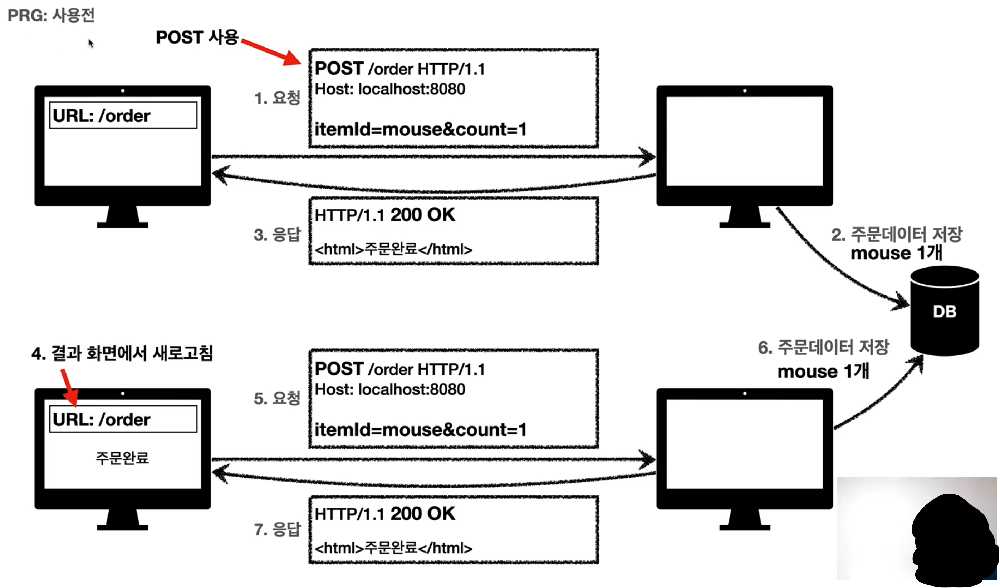
            + 사용 후
              + 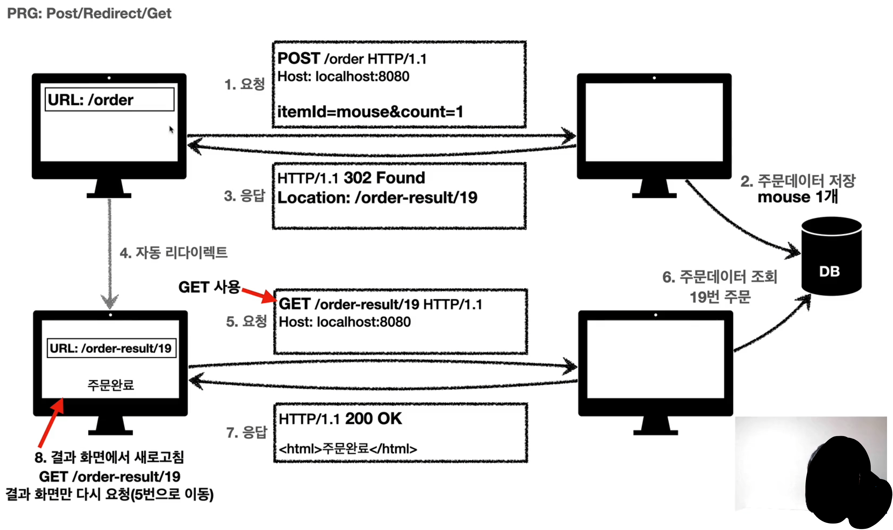
              + URL이 이미 POST -> GET으로 Redirect 됨
              + 새로 고침 해도 GET으로 결과 화면만 조회
          + 역사 :
            + 처음 302 스펙의 의도는 HTTP 메서드를 유지하는 것
            + 그런데 웹 브라우저들이 대부분 GET으로 바꾸어버림 (일부는 다르게 동작)
            + 그래서 모호한 302를 대신하는 303,307이 등장함 (301 대응으로 308도 등장)
          + 현실 : 
            + 303 307을 권장하지만 현실적으로 이미 많은 애플리케이션 라이브러리들이 302를 기본값으로 사용
            + 자동 Redirection 시에 GET 으로 변해도 되면 그냥 302를 사용해도 큰 문제 없음
        + #### 특수 Redirection
          + 결과 대신 캐시를 사용 
      + #### 종류 
        + 300 Multiple Choices
          + 안 쓴다.
        + 301 Moved Permanently (영구 Redirection)
          + Redirect시 요청 메서드가 GET으로 변하고, 본문이 제거될 수 있음 (MAY)
          + 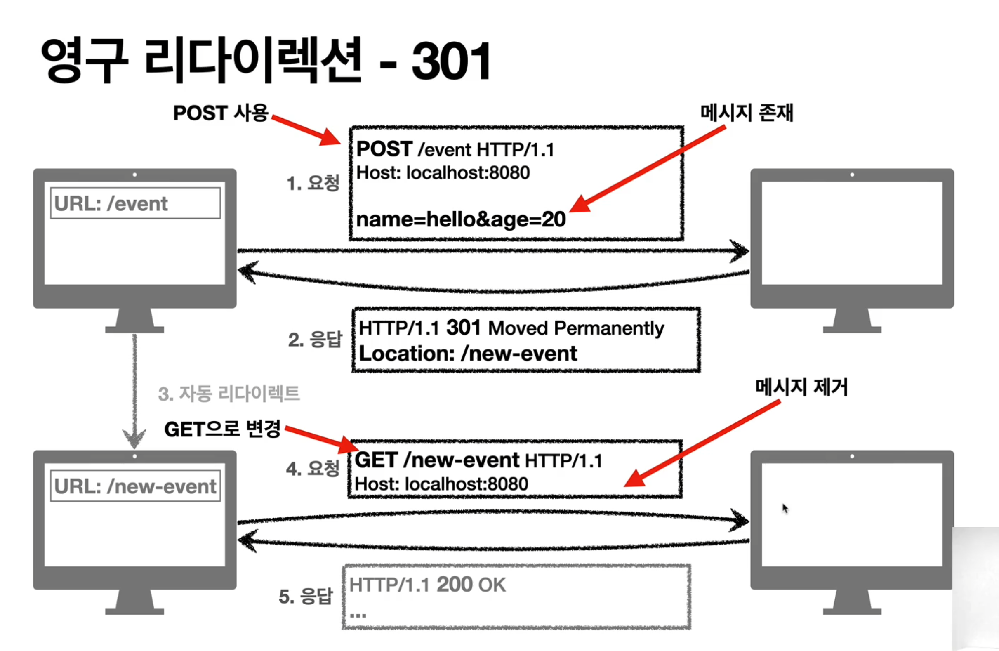
        + 302 Found (일시 Redirection)
          + Redirect시 요청 메서드가 GET으로 변하고, 본문이 제거될 수 있음 (MAY)
        + 303 See Other (일시 Redirection)
          + 302와 기능은 같음
          + Redirect시 요청 메서드가 GET으로 변경
        + 304 Not Modified
          + 캐시를 목적으로 사용
          + 클라이언트에게 리소스가 수정되지 않았음을 알려준다.
          + 따라서 클라이언트는 Local PC에 저장된 캐시를 재 사용한다. (캐시로 Redirect 한다)
          + 304 응답은 응답에 메시지 바디를 포함하면 안된다. (Local 캐시를 사용해야 하므로)
          + 조건부 GET, HEAD 요청시 사용
        + 307 Temporary Redirect (일시 Redirection)
          + 302와 기능은 같음
          + Redirect시 요청 메서드와 본문 유지 (요청 메서드를 변경하면 안된다. MUST NOT)
        + 308 Permanent Redirect (영구 Redirection)
          + 301과 기능은 같음
          + Redirect시 요청 메서드와 본문 유지(처음 POST를 보내면 Redirect도 POST)
          + 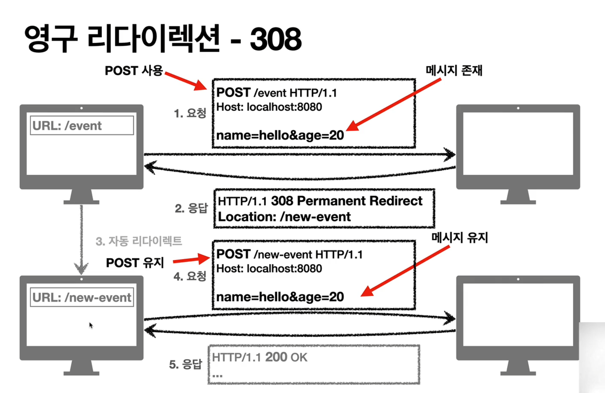
          
    + ### 4xx (Client Error)
      + ### 정의
        + 클라이언트의 요청에 잘못된 문법 등으로 서버가 요청을 수행할 수 없음
        + 오류의 원인이 클라이언트에 있음
        + 중요! 클라이언트가 이미 잘못된 요청, 데이터를 보내고 있기 때문에, 똑같은 재시도가 실패함
      + ### 종류
        + 400 Bad Request
          + 설명 : 클라이언트가 잘못된 요청을 해서 서버가 요청을 처리할 수 없음
            + 요청 구문, 메시지 등등 오류
            + 클라이언트는 요청 내용을 다시 검토하고, 보내야함
            + 예) 요청 파라미터가 잘못되거나, API 스펙이 맞지 않을 때
        + 401 Unauthorized
          + 설명 : 클라이언트가 해당 리소스에 대한 인증이 필요함
            + 인증(Authentication) 되지 않음
            + 401 오류 발생이 응답에 WWW-Authenticate 헤더와 함께 인증 방법을 설명
          + 참고
            + 인증(Authentication) : 본인이 누구인지 확인, (로그인)
            + 인가(Authorization) : 권한 부여 (ADMIN 권한처럼 특정 리소스에 접근할 수 있는 권한, 인증이 있어야 인가가 있음)
            + 오류 메시지가 Unauthorized 이지만 인증 되지 않음
        + 403 Forbidden
          + 설명 : 서버가 요청을 이해했지만 승인을 거부함
            + 주로 인증 자격 증명은 있지만, 접근 권한이 불충분한 경우
            + 예) 어드민 등급이 아닌 사용자가 로그인은 했지만, 어드민 등급의 리소스에 접근하는 경우
        + 404 Not Found
          + 설명 : 요청 리소스를 찾을 수 없음
            + 요청 리소스가 서버에 없음
            + 또는 클라이언트가 권한이 부족한 리소스에 접근할 때 해당 리소스를 숨기고 싶을 때
    
    + ### 5xx (Server Error)
      + ### 정의
        + 서버 문제로 오류 발생
        + 서버에 문제가 있기 때문에 재시도 하면 성공할 수도 있음 (복구 등)
      + ### 종류
        + 500 Internal Server Error
          + 설명 : 서버 문제로 오류발생, 애매하면 500 오류
        + 502 Bad Gateway
          + 설명 : 서로 다른 프로토콜을 연결해주는 장치가 잘못된 프로토콜을 연결하거나, 어느쪽 프로토콜에 문제가 있어 통신이 제대로 되지 않을 때
        + 503 Service Unavailable
          + 설명 : 서비스 이용 불가
            + 서버가 일시적인 과부하 또는 예정된 작업으로 잠시 요청을 처리할 수 없음
            + Retry-After 헤더 필드로 얼마뒤에 복구되는지 보낼 수도 있음
            
  + ### HTTP 헤더
    + ### 용도
      + HTTP 전송에 필요한 모든 부가정보
      + 예) 메시지 바디의 내용, 메시지 바디의 크기, 압축, 인증, 요청 클라이언트, 서버 정보, 캐시 관리정보 등
      + 표준 헤더가 너무 많음
      + 필요시 임의의 헤더 추가 가능
      + #### 과거
        + RFC2616 - 폐기됨
          + 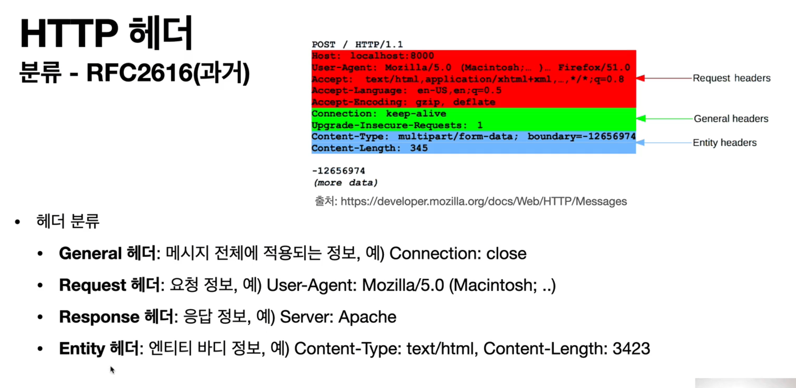
          + 헤더 분류
            + General 헤더 
              + 메시지 전체에 적용되는 정보
              + 예) Connection: close
            + Request 헤더
              + 요청 정보
              + 예) User-Agent: Mozilla/5.0 (Macintosh; ..)
            + Response 헤더
              + 응답 정보
              + 예) Server: Apache
            + Entity 헤더
              + 엔티티 바디 정보
              + 예) Content-Type: text/html, Content-Length: 3423
          + HTTP BODY
            + 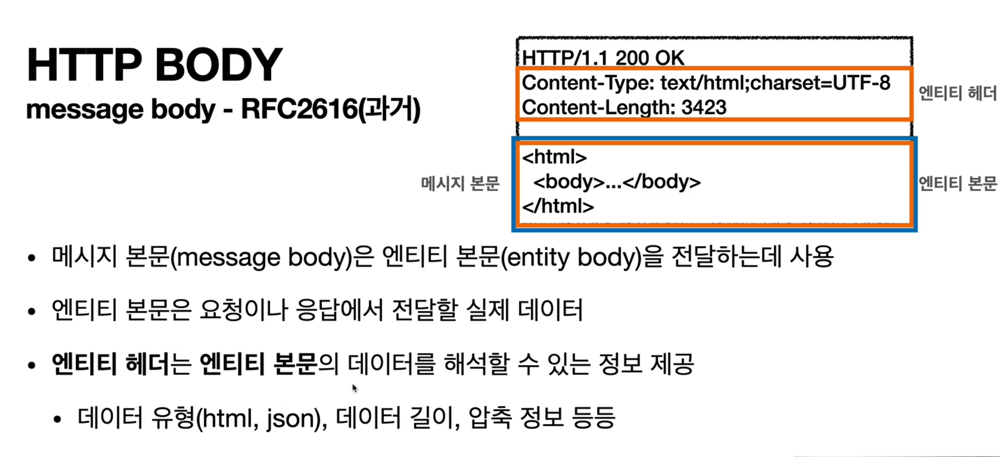
            + 메시지 본문(message body)은 엔티티 본문(entity body)을 전달하는데 사용
            + 엔티티 본문은 요청이나 응답에서 전달할 실제 데이터
            + 엔티티 헤더는 엔티티 본문의 데이터를 해석할 수 있는 정보 제공
              + 데이터 유형(html, json), 데이터 길이, 압축 정보 등등
      + #### 현재
        + RFC723x 
          + RFC2616으로부터 변경점 : 
            + 엔티티(Entity) -> 표현(Representation)
            + Representation = Representation Metadata + Representation Data
            + 표현 = 표현 메타데이터 + 표현 데이터
          + HTTP BODY
            + 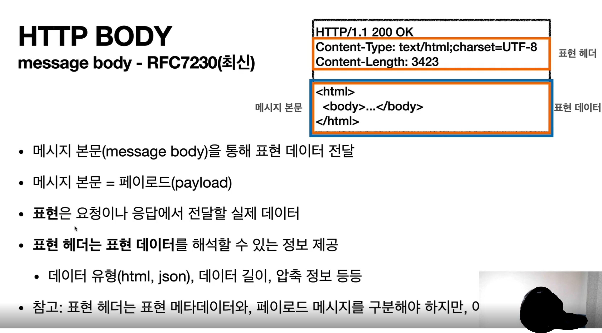
            + 메시지 본문(message body)을 통해 표현 데이터 전달
            + 메시지 본문 = 페이로드(payload)
            + 표현은 요청이나 응답에서 전달할 실제 데이터
            + 표현 헤더는 표현 데이터를 해석할 수 있는 정보 제공
              + 데이터 유형(html, json), 데이터 길이, 압축 정보 등등
            + 참고 : 
              + 표현 헤더는 메타 데이터와, 페이로드 메시지를 구분해야 하지만, 너무 복잡해지기에 생략
              
    + ### 표현 Header
      + 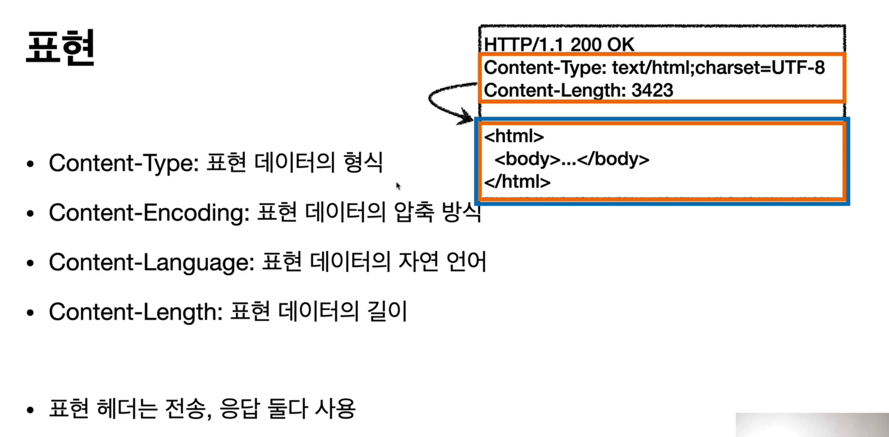
      + #### 정의 
        + Content-Type : 표현 데이터의 형식
          +  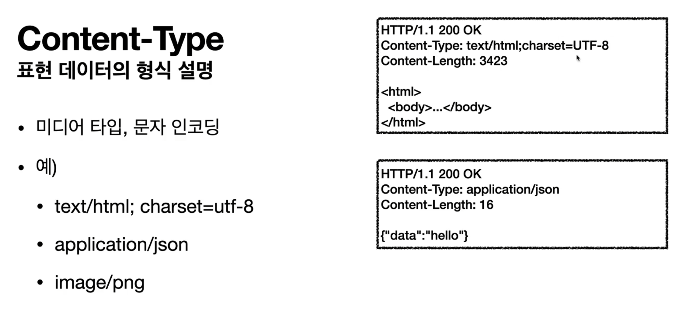
          + Media-Type, 문자 인코딩
          + 예)
            + text/html;charset=UTF-8
            + application/json
            + image/png
        + Content-Encoding : 표현 데이터의 압축 방식
          + 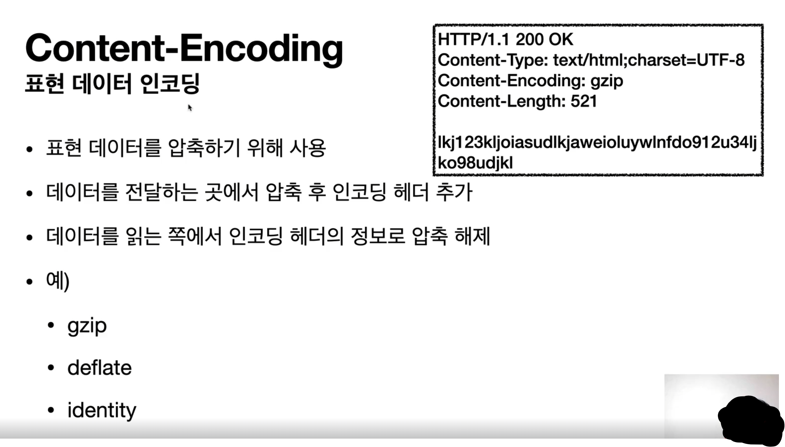
          + 표현 데이터를 압축하기 위해 사용
          + 데이터를 전달하는 곳에서 압축 후 인코딩 헤더 추가
          + 데이터를 읽는 쪽에서 인코딩 헤더의 정보로 압축 해제
          + 예)
            + gzip
            + deflate
            + identity
        + Content-Language : 표현 데이터의 자연 언어
          + 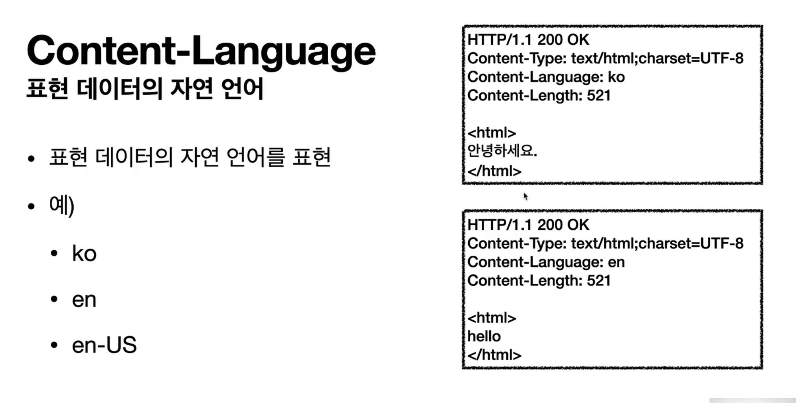
          + 표현 데이터의 자연 언어를 표현
          + 예)
            + ko
            + en
            + en-US
        + Content-Length : 표현 데이터의 길이
          + 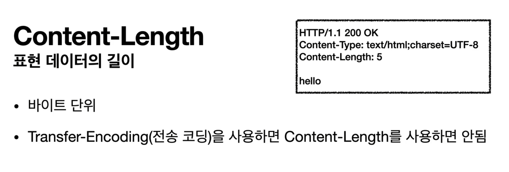
          + 바이트 단위
          + <U>**Transfer-Encoding(전송 코딩)을 사용하면 Content-Length를 사용하면 안됨**</U>
        + 표현 헤더는 전송, 응답 둘다 사용
    
    + ### 협상 Header (Content-Negotiation)
      + 설명 : 
        + 클라이언트가 선호하는 표현 요청
      + #### 정의
        + Accpet : 클라이언트가 선호하는 미디어 타입 전달
        + Accept-Charset : 클라이언트가 선호하는 문자 인코딩
        + Accept-Encoding : 클라이언트가 선호하는 압축 인코딩
        + Accept-Language : 클라이언트가 선호하는 자연 언어
          + #### 적용 전
            + 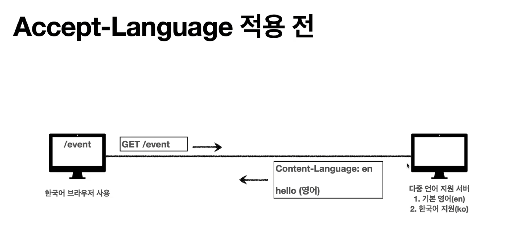
          + #### 적용 후
            + 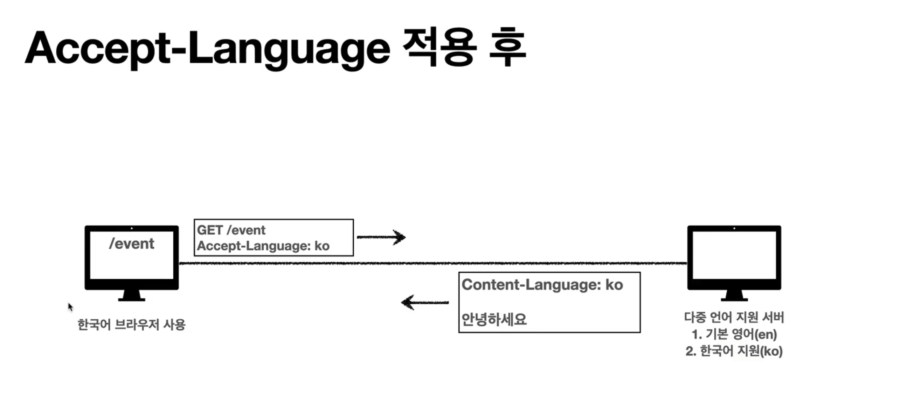
          + #### 복잡한 예시
            + 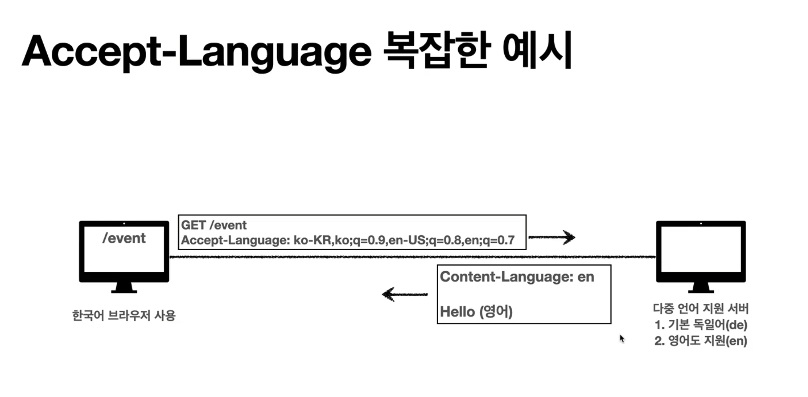
        + 협상 헤더는 요청시에만 사용
      + #### 우선 순위 1 [Quality Values (q)]
        + 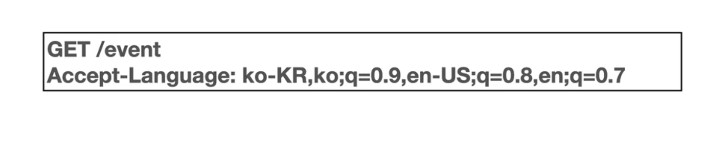
        + Quality Values(q) 값 사용
        + 0~1, 클수록 높은 우선순위
        + 생략하면 1
        + Accept-Language: ko-KR,ko;q=0.9,en-US;q=0.8,en;q=0.7
          1. ko-KR;q=1 (생략)
          2. ko;q=0.9
          3. en-US;q=0.8
          4. en;q=0.7
      + #### 우선 순위 2 [Quality Values (q)]
        + 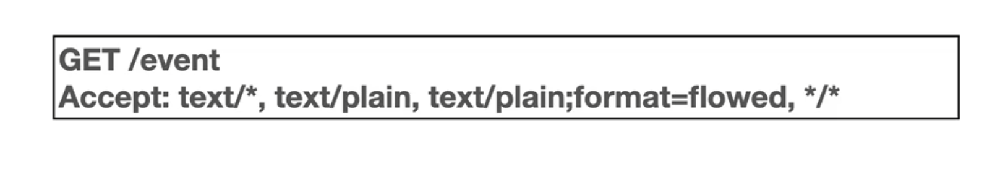
        + 구체적인 것이 우선한다.
        + Accept: text/*, text/plain, text/plain;format=flowed, */*
          1. text/plain;format=flowed
          2. text/plain
          3. text/*
          4. */*
      + #### 우선 순위 3 [Quality Values (q)]
        + 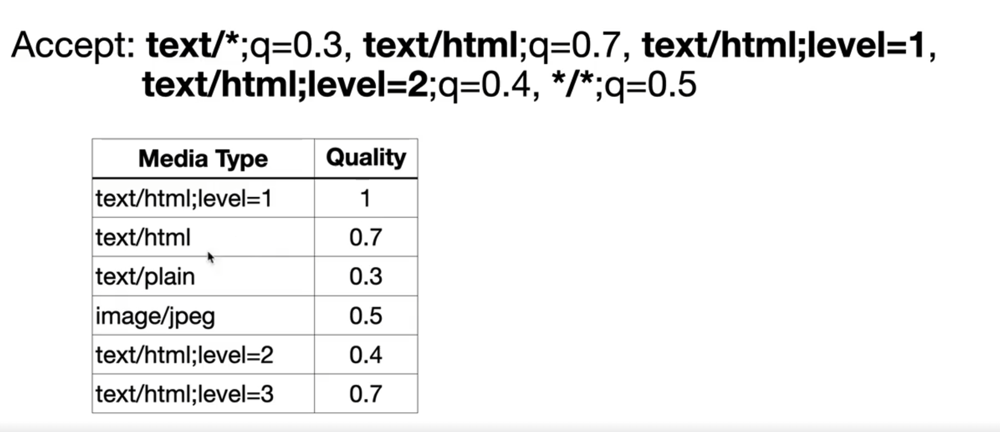
        + 구체적인 것을 기준으로 미디어 타입을 맞춘다.
        + Accept: text/*;q=0.3, text/html;q=0.7, text/html;level=1, text/html;level=2;q=0.4, */*;q=0.5
          1. text/html;level=1
          2. text/html
          3. text/plain
          4. image=/jpeg
          5. text/html;level=2
          6. text/html;level=3