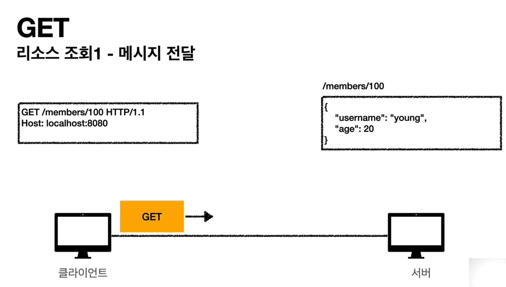

# http-study

+ ## 인터넷 네트워크
  + ### 인터넷 통신
  + ### IP(Internet Protocol)
    + 지정한 IP 주소(IP Address)에 데이터 전달
    + 패킷(Packet)이라는 통신 단위로 데이터 전달
    + 패킷
      + 
    + IP 프로토콜의 한계
      + 비연결성
        + 패킷을 받을 대상이 없거나 서비스 불능 상태여도 패킷 전송
          + 
      + 비신뢰성
        + 중간에 패킷이 사라지면?
          + 
        + 패킷이 순서대로 오지 않으면?
          + 
      + 프로그램 구분
        + 같은 IP를 사용하는 서버에서 통신하는 애플리케이션이 둘 이상이면?
  + ### 인터넷 프로토콜 스택의 4계층
    + 
    + 
      + ### 1. 애플리케이션 계층 - HTTP, FTP
        +    
      + ### 2. 전송 계층 - TCP, UDP
        + TCP : 전송 제어 프로토콜 (Transmission Control Protocol)
          + 특징
            + 연결 지향 - TCP 3 way handshake (가상 연결)
              + 3 way handshake
                + 
                + TCP/IP 프로토콜을 이용해서 통신을 하는 응용프로그램이 데이터를 전송하기 전에 먼저 정확한 전송을 보장하기 위해 상대방 컴퓨터와 사전에 에션을 수립하는 과정
            + 데이터 전달 보증
              + 
            + 순서 보장
              + 
            + 신뢰할 수 있는 프로토콜
            + 현재는 대부분 TCP 사용
          + TCP 세그먼트
            + 출발지 PORT
            + 목적지 PORT
            + 전송 제어
            + 순서
            + 검증 정보
        + UDP : 사용자 데이터그램 프로토콜 (User Datagram Protocol)
          + 특징
            + 하얀 도화지에 비유(기능이 거의 없음)
            + 연결 지향 - TCP 3 way handshake X
            + 데이터 전달보증 X
            + 순서 보장 X
            + 데이터 전달 및 순서가 보장되지 않지만, 단순하고 빠름
            + 정리
              + IP와 거의 같다. PORT 체크성 정도만 추가
              + 애플리케이션에서 추가 작업 필요
      + ### 3. 인터넷 계층 - IP
        + IP 패킷 정보 
          + 출발지 IP
          + 목적지 IP
      + ### 4. 네트워크 인터페이스 계층
+ ## HTTP 메서드
  + API URI 고민
    + 리소스의 의미
      + 회원을 등록하고 수정하고 조회하는게 리소스가 아니다!
      + 예) 미네랄을 캐라 -> <U>**미네랄**</U>이 리소스
      + <U>**회원이라는 개념 자체가 바로 리소스다.**</U>
    + 리소스를 어덯게 식별하는게 좋을까?
      + 회원을 등록하고 수정하고 조회하는 것을 모두 배제
      + <U>**회원이라는 리소스만 식별하면 된다. -> 회원 리소스를 URI에 매핑**</U>
  + 리소스와 행위를 분리 
    + URI는 리소스만 식별!
    + 리소스와 해당 리소소를 대상으로 하는 행위를 분리
      + 리소스 : 회원
      + 행위 : 조회, 등록, 삭제, 변경
    + 리소스는 명사, 행위는 동사
  + 메서드 종류
    + GET : 리소스 조회
      + 의미 : 
        + 리소스 조회
        + 서버에 전달하고 싶은 데이터는 query(쿼리 파라미터, 쿼리 스트릴)를 통해서 전달
        + 메시지 바디를 사용해서 데이터를 전달할 수 있지만, 지원하지 않는 곳이 많아서 권장하지 않음
      + 순서 : 
        + 1. 리소스 조회 - 메시지 전달
          + 
        + 2. 리소스 조회 - 서버 도착 
          + 
        + 3. 리소스 조회 - 응답 데이터
          + 
    + POST : 요청 데이터 처리, 주로 등록에 사용
      + 의미 : 
        + 요청 데이터 처리
        + <U>**메시지 바디를 통해 서버로 요청 데이터 전달**</U>
        + 서버는 요청 데이터를 처리
          + 메시지 바디를 통해 들어온 데이터를 처리하는 모든 기능을 수행한다.
        + 주로 전달된 데이터로 신규 리소스 등록, 프로세스 처리에 사용
      + 순서 : 
        + 1. 리소스 등록 - 메시지 전달
          + 
        + 2. 리소스 등록 - 신규 리소스 생성
          + 
        + 3. 리소스 등록 - 응답 데이터
          + 
    + PUT : 리소스를 (완전히) 대체, 해당 리소스가 없으면 생성 
    + PATCH : 리소스 부분 변경
    + DELETE : 리소스 삭제
    + HEAD : GET과 동일하지만 메시지 부분을 제외하고, 상태 줄과 헤더만 반환
    + OPTIONS : 대상 리소스에 대한 통신 가능 옵션(메서드)을 설명(주로 CORS에서 사용)
    + CONNECT : 대상 자원으로 식별되는 서버에 대한 터널을 설정
    + TRACE : 대상 리소스에 대한 경로를 따라 메시지 루프백 테스트를 수행